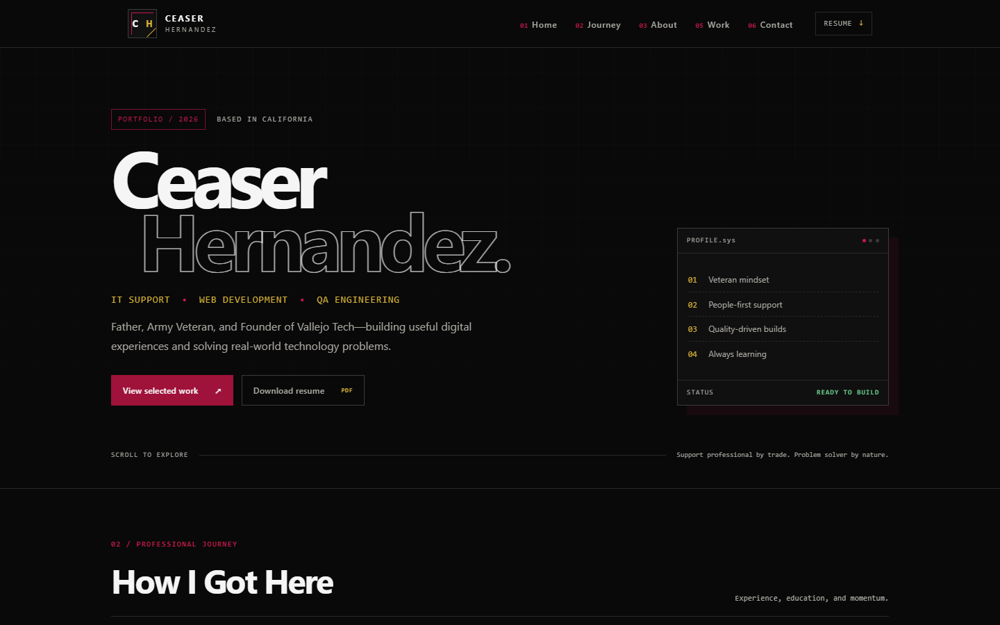

<div align="center">
  

  # Ceaser Hernandez — Portfolio

  **IT support professional, web developer, QA engineer, Army veteran, and founder of Vallejo Tech.**

  [](https://ceaserhernandez.com)
  [](https://www.linkedin.com/in/ceaser-hernandez)
  [](mailto:contact@ceaserhernandez.com)
</div>

<br />



## About the project

This repository contains my personal portfolio—a focused introduction to my professional journey, technical work, interests, and the values I bring to every project.

The visual system combines a dark editorial layout with technical interface details, numbered sections, crimson and gold accents, and a custom CH monogram. The site is designed to feel personal and distinctive while remaining fast, accessible, and responsive.

## Selected work

| Project | Description | Links |
| --- | --- | --- |
| **Vallejo Tech** | Business website for approachable IT services and PC repair. | [Live site](https://vallejotech.org) · [Repository](https://github.com/CeaserH/vallejo-tech) |
| **Soulful Customs** | Custom-printing storefront for personalized products and photo keepsakes. | [Live site](https://soulfulcustoms.shop) · [Repository](https://github.com/CeaserH/soulfulcustoms) |
| **Crimson Dusk** | Team-built zombie survival FPS created as a school capstone project. | [Repository](https://github.com/CeaserH/CrimsonDusk) |

## Built with

<p>
  
  
  
  
  
  
</p>

- React component architecture
- Responsive, custom CSS design system
- Lucide interface icons
- Resume and project-preview assets
- Automated GitHub Pages deployment
- Serverless contact API with validation and spam protection

## Contact flow

```text
Portfolio contact form
        │
        ▼
Cloudflare Turnstile
        │ verified token
        ▼
Cloudflare Worker
        │ validation + CORS
        ▼
Resend email delivery
        │
        ▼
contact@ceaserhernandez.com
```

The Worker:

- accepts requests only from approved portfolio origins;
- validates and limits all submitted fields;
- quietly filters honeypot submissions;
- verifies Turnstile tokens server-side;
- escapes user-provided content before generating HTML;
- uses the visitor's address as `Reply-To`;
- keeps all API keys in encrypted Cloudflare Worker secrets.

## Run locally

### Portfolio

```bash
git clone https://github.com/CeaserH/ceaserhernandez.git
cd ceaserhernandez
npm install
npm run dev
```

The site will be available at `http://localhost:5173`.

Useful commands:

```bash
npm run lint
npm run build
npm run preview
```

### Contact Worker

```bash
cd contact-worker
npm install
npm test -- --run
npm run dev
```

Production requires these encrypted Worker secrets:

```text
RESEND_API_KEY
TURNSTILE_SECRET_KEY
```

Never commit their values. Add them with:

```bash
npx wrangler secret put RESEND_API_KEY
npx wrangler secret put TURNSTILE_SECRET_KEY
```

## Project structure

```text
ceaserhernandez/
├── .github/workflows/       # GitHub Pages deployment
├── contact-worker/          # Serverless contact API and tests
├── public/                  # Resume, favicon, CNAME, and previews
├── src/
│   ├── components/
│   │   ├── home/            # Portfolio sections
│   │   └── layout/          # Navigation and footer
│   ├── data/                # Project and timeline content
│   └── styles/              # Global design tokens and resets
├── index.html
└── vite.config.js
```

## Deployment

Pushes to `main` trigger the GitHub Pages workflow:

1. Install locked dependencies with `npm ci`.
2. Build the production site with Vite.
3. Upload the `dist` artifact.
4. Deploy to GitHub Pages.

The custom domain is declared in [`public/CNAME`](./public/CNAME).

---

<div align="center">
  Built with purpose in California by <a href="https://www.linkedin.com/in/ceaser-hernandez">Ceaser Hernandez</a>.
</div>
